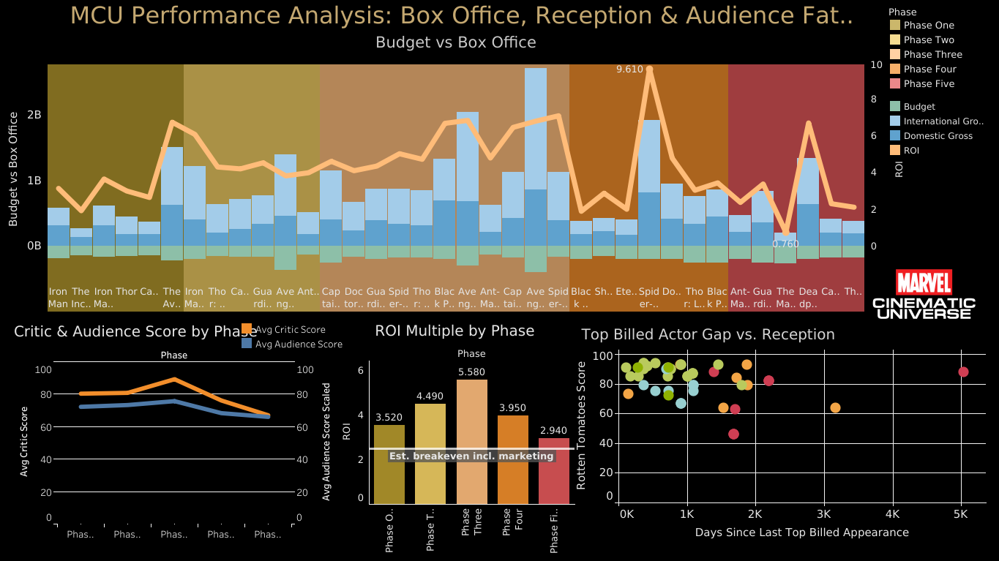

# MCU Performance Analysis

A data analysis project investigating whether the Marvel Cinematic Universe's box office and critical reception decline in recent years is driven by audience fatigue, quality decline, or other factors — using a full relational dataset built from scratch across all 36 theatrical MCU films (Phase One through Phase Five).


<a href="https://public.tableau.com/app/profile/alex8184/viz/MCUDataAnalysis/Dashboard1" target="_blank" rel="noopener noreferrer"><strong>View the interactive dashboard on Tableau Public →</strong></a>



## The question

Is the MCU's box office and critical decline since Phase Four driven by franchise fatigue, a genuine drop in quality, or release-strategy factors — and what does that say about how a studio should sequence a long-running franchise?

## Headline findings

- **Reception and ROI declined together, not apart.** Critic and audience scores move in the same direction across every phase — the gap between them is actually *widest* at Phase Three (the franchise's peak) and *narrowest* at Phase Five. This rules out the common "audiences turned on Marvel while critics stayed loyal" narrative in favor of a shared decline in perceived quality.
- **Phase Five's ROI (2.94x) is lower than Phase One's (3.52x)** — despite the franchise having 15+ years of brand equity and a far larger built-in audience than it had at launch.
- **Runtime stayed flat** (131 min average, Phase 1-3, vs. 133 min, Phase 4-5), ruling out "bloated runtimes" as a driver of the decline.
- **Actor-fatigue (long gaps between a lead's appearances) shows no strong, consistent correlation** with reception — a hypothesis worth testing, but not one the data clearly supports.

Full methodology, caveats, and supporting detail are in [`ANALYSIS.md`](ANALYSIS.md).

## Tech stack

| Layer | Tool |
|---|---|
| Data collection | Python (`requests`) against TMDB and OMDb APIs |
| Financial data | Manually compiled from The Numbers |
| Database | PostgreSQL |
| Querying / transformation | SQL (joins, window functions, views) |
| Visualization | Tableau Public |

## Project structure

```
mcu_project/
├── data/                    # Raw and processed CSVs
│   ├── mcu_films_seed.csv
│   ├── films_tmdb.csv
│   ├── cast_tmdb.csv
│   ├── ratings_omdb.csv
│   └── boxoffice_template.csv
├── scripts/                 # Python data collection scripts
│   ├── verify_tmdb_ids.py
│   ├── enrich_tmdb.py
│   └── enrich_omdb.py
├── sql/                     # PostgreSQL schema, cleaning, and analysis queries
│   ├── 01_create_schema.sql
│   ├── 02_clean_ratings.sql
│   ├── 03_fix_phase_mislabel.sql
│   ├── 04_core_analysis.sql
│   ├── 05_tableau_views.sql
│   └── 06_correlation_analysis.sql
├── dashboard/                # Tableau exports / dashboard assets
├── ANALYSIS.md               # Full write-up: methodology, findings, caveats
└── README.md                 # This file
```

## How the data was built

1. **Collected** film metadata, cast, and ratings via the TMDB and OMDb APIs (see `scripts/`)
2. **Verified** every TMDB ID against a live search before trusting it, rather than assuming hand-entered IDs were correct
3. **Compiled** budget and box office figures by hand from The Numbers, using a single consistent source to avoid cross-site discrepancies
4. **Loaded** everything into a normalized PostgreSQL schema with foreign-key relationships across five tables (`films`, `film_details`, `film_cast`, `ratings`, `financials`)
5. **Cleaned** text-formatted fields (e.g. `"94%"`, `"1,223,183"`) into real numeric columns
6. **Analyzed** using SQL — including window functions (`LAG()`) to calculate time between an actor's MCU appearances, and `CORR()` for correlation analysis
7. **Visualized** via Tableau Public, built on a set of pre-joined SQL views designed specifically for flat-file export

## Data sources

- [TMDB](https://www.themoviedb.org/) — cast, crew, runtime, genres
- [OMDb](https://www.omdbapi.com/) — IMDb rating, Rotten Tomatoes score, Metascore
- [The Numbers](https://www.the-numbers.com/) — budget, opening weekend, domestic and worldwide gross

## Limitations

- ROI is calculated as worldwide gross ÷ budget and does **not** include marketing/distribution spend, which can roughly double the real breakeven point for a major theatrical release. Treat ROI figures as a relative comparison across phases, not literal profit.
- Phase Six is excluded from era comparisons — at the time of data collection, only one Phase Six film had been released, too small a sample to draw any conclusion from.
- The actor-appearance-gap analysis only considers top-3-billed roles in theatrical releases; it does not account for Disney+ series appearances, which are a real part of some actors' continuity but outside this dataset's scope.
- Sample size is 36 films — small enough that any single outlier (e.g. *Avengers: Endgame*) can meaningfully shift an average or correlation. Where relevant, this is called out directly in the write-up.

## Author

Built by Alex Isabella as a portfolio project. See [`ANALYSIS.md`](ANALYSIS.md) for the full analytical write-up.
